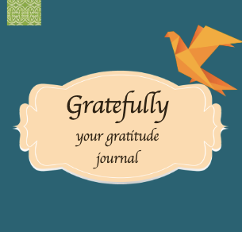

# Welcome to the gratitude-journal 

Hi,

gratitude - journal is no commercial project. It is my capstone project made during the last month of coding bootcamp at neue fische, Cologne. It is optimized for mobile view (iphone 6 / 7 / 8).

Gratefully- your gratitude journal is about becoming happier by focusing on the positive aspects in your life.
Input forms with a few questions help you to log your happy and thankful moments during a day.

#### See Storybook of the projects Components here: <https://gratefully-storybook.netlify.app/>

### Getting Started

This project requires mongodb.
These instructions will get you a copy of the project up and running on your local machine for development and testing purposes.

#### Clone this repository and start with installation of the server side

first install dev dependencies on the server side: npm install

#### Continue on the client side

npm install

## Running the application:

Open split Terminal on your developement environment

npm run client

npm run server

Now the system will provide a link, you can click on and you will see the application in the Browser.

Enjoy Gratefully- your gratitude journal.
